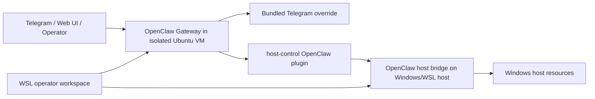

# OpenClaw Isolated Deployment

This repository is a reference implementation for running **OpenClaw in a truly
isolated local environment** instead of collapsing the assistant, host control,
and operator tooling into one machine with one trust boundary.

It exists to solve a specific problem:

- keep the OpenClaw runtime isolated from the daily-use workstation
- keep host-PC control behind a narrow, explicit bridge
- keep Telegram and other user-facing control surfaces deterministic enough for real operations
- document the whole system so another operator can reproduce it without inheriting local folklore

This is not just a scratchpad for one machine. The goal is an explainable, reusable deployment model with clear trust boundaries.

## Why This Repository Exists

The default local story for personal assistants is usually some variation of:

- install everything on the main workstation
- connect channels directly
- grant broad local execution
- debug problems live in production

That works quickly, but it muddies the trust boundary. The runtime, the host, the operator shell, and the user-facing surface become the same place.

This repository takes the opposite approach:

- **OpenClaw runtime** lives in an isolated Ubuntu VM
- **Operator workflow** lives in WSL on the Windows workstation
- **Host-PC control** goes through a separate `openclaw-host-bridge`
- **Telegram behavior** is tightened so host actions stay deterministic and auditable

That separation is the whole reason this repository exists.

## What This Repository Contains

```text
openclaw-isolated-deployment/
├── README.md
├── docs/
│   ├── architecture-overview.md
│   ├── repository-map.md
│   ├── local-deployment-guide.md
│   ├── wsl-codex-runbook.md
│   ├── security-architecture-review.md
│   ├── host-control-openclaw-model.md
│   └── ...
├── deployment/
│   ├── build-checklist.md
│   └── vm-baseline.md
├── openclaw-host-bridge/
├── host-control-openclaw-plugin/
├── openclaw-telegram-enhanced/
└── ...
```

## Repository Roles

The repository is intentionally split into separate subprojects with separate responsibilities.

| Path | Purpose |
| --- | --- |
| `openclaw-host-bridge/` | Narrow host-control bridge that enforces policy, allowed roots, audits, and controlled host operations. |
| `host-control-openclaw-plugin/` | Model-scoped reference copy of the typed host-control plugin for this isolated deployment design. |
| `openclaw-telegram-enhanced/` | Reference copy of the Telegram replacement used to explain the isolated deployment model. |
| `docs/` | System documentation: architecture, rationale, operator runbooks, known issues, and security review. |
| `deployment/` | Deployment-specific guidance, checklists, and runtime-facing configuration notes. |

Read the full repo map here:
- [repository-map.md](docs/repository-map.md)
- [workspace-sync-policy.md](docs/workspace-sync-policy.md)
- [current-runtime-shape.md](docs/current-runtime-shape.md)

## Workspace Layout

To reproduce this deployment model cleanly, use a multi-repo workspace under a common parent directory.

Example:

```text
~/projects/
├── openclaw-isolated-deployment/
├── openclaw-runtime-distribution/
├── openclaw-host-bridge/
└── openclaw-telegram-enhanced/
```

This is the intended split:

- `openclaw-isolated-deployment` is the system and reference-architecture workspace
- `openclaw-runtime-distribution` is the current governed stage/prod build and composition workspace
- `openclaw-host-bridge` is the canonical bridge source repository
- `openclaw-telegram-enhanced` is the canonical Telegram channel source repository

Important:

- the bridge source of truth is the standalone `openclaw-host-bridge` repo, not the small bridge README copy inside this repository
- the Telegram source of truth is the standalone `openclaw-telegram-enhanced` repo; the local embedded copy in this repo is no longer the active governed build input
- the active stage/prod packaged `host-control-openclaw-plugin/` now lives in `openclaw-runtime-distribution`; the local copy here is reference/model-scoped

If someone clones only this repository, they will understand the architecture,
but they will not have the full active build/composition workspace or the full
standalone bridge source tree required for the current governed host-control
workflow.

## Architecture



The important part is not the specific products. It is the separation of duties:

- the **Gateway** orchestrates
- the **Telegram override** controls channel behavior
- the **plugin** translates typed assistant intent into allowed operations
- the **bridge** enforces host policy
- the **host** is never the trust anchor for OpenClaw itself

Read the detailed architecture here:
- [architecture-overview.md](docs/architecture-overview.md)

## Isolation Model

The supported deployment model in this repository is:

**Windows workstation -> WSL operator workspace -> isolated Ubuntu VM -> Docker-based OpenClaw runtime -> explicit bridge back to the Windows host for narrow PC control**

This model is chosen because it gives clear answers to questions like:

- Where does the assistant runtime live?
- Where do secrets live?
- Where does host file access actually happen?
- What is the audit point for host-control requests?
- What is allowed to touch the primary workstation directly?

## Design Principles

- **Isolation before convenience**: the runtime should not default to living on the main workstation.
- **Typed host control over raw shell**: host access should go through explicit operations with policy and audit.
- **Deterministic user flows**: Telegram should not hallucinate tool plans for sensitive host actions.
- **Documentation follows reality**: if the implementation changes, the docs change in the same work.
- **Clear by default**: docs should explain why the system exists, not assume private local context.

## Current Scope

This repository currently documents and implements:

- isolated OpenClaw deployment patterns
- host bridge enforcement for file, health, export, and monitor actions
- Telegram confirmation and deterministic routing for `host-control`
- self-heal and runtime verification patterns for the host bridge

It does **not** claim to be:

- a full production HA platform
- a general replacement for upstream OpenClaw docs
- a public multi-tenant service template

## Current Operating Relationship

For the current governed workspace:

- this repo explains the isolated deployment design
- `openclaw-runtime-distribution` owns the active stage/prod runtime assembly
- `platform-engineering` owns environment approval, digests, and promotion
- `openclaw-host-bridge` owns the runnable host bridge
- `openclaw-telegram-enhanced` owns the canonical Telegram implementation

That split is intentional. This repo should remain the place where operators can
understand the architecture, even when the active build path lives elsewhere.

## Audit And Visibility

This repository is documentation-first, so its visibility surfaces are mainly:

- architecture docs that explain the trust boundary
- repository maps that explain owner vs reference copies
- current runtime shape docs that explain how the live system is meant to look
- security review notes that explain why the model exists

It is not the runtime evidence source for stage or prod. For live evidence,
operators should look to:

- `platform-engineering` for approved SHAs, digests, and Argo revisions
- `openclaw-host-bridge` for host audit and bridge attestation
- the live gateway and Telegram logs for runtime behavior

## Start Here

For someone new to this repository, the right reading order is:

1. [architecture-overview.md](docs/architecture-overview.md)
2. [repository-map.md](docs/repository-map.md)
3. [current-runtime-shape.md](docs/current-runtime-shape.md)
4. [local-deployment-guide.md](docs/local-deployment-guide.md)
5. [security-architecture-review.md](docs/security-architecture-review.md)
6. [host-control-openclaw-model.md](docs/host-control-openclaw-model.md)

If you are rebuilding the operator workstation, then use:
- [wsl-codex-runbook.md](docs/wsl-codex-runbook.md)

If you are maintaining the current governed stage/prod build path, start in:
- `openclaw-runtime-distribution/README.md`
- `platform-engineering/products/openclaw/runbooks/rebuild-and-promote-gateway.md`

If you are maintaining the reference architecture and need to understand how the
older embedded-copy model related to the isolated deployment design, use:
- [workspace-sync-policy.md](docs/workspace-sync-policy.md)

## Governance Moving Forward

- Keep this repo explicit about whether a path is canonical, active, or
  reference-only.
- When the governed runtime shape changes, update the corresponding architecture
  and runtime-shape docs here in the same change class.
- Do not let old embedded-copy workflows look active if they are no longer part
  of the current build path.

## Documentation Standard

In this repository, a fix is not complete until:

1. the implementation is updated
2. the relevant documentation is updated
3. the docs explain both the **what** and the **why**

That rule exists because this repository is meant to be useful to the next operator, not only the original one.
