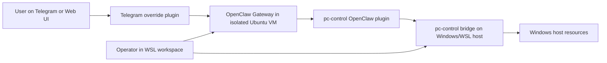
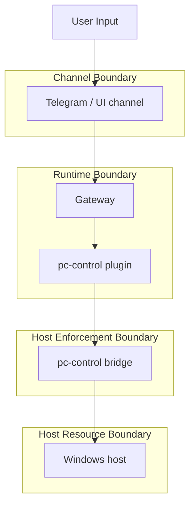
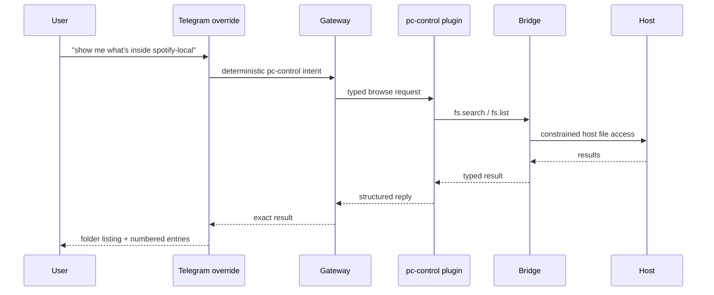
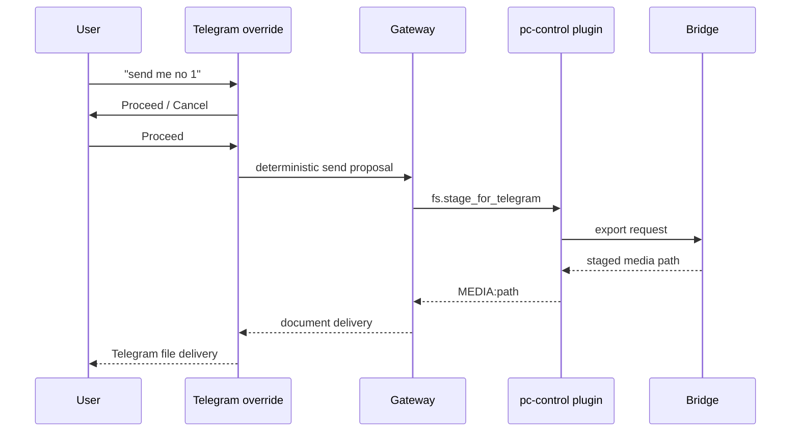
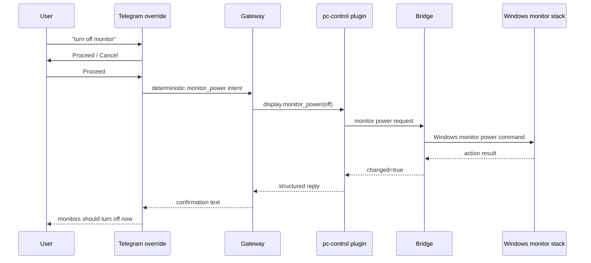

# Architecture Overview

## Purpose

This document explains the architecture of the isolated OpenClaw deployment in terms that are useful to another operator, maintainer, or reviewer.

It answers four questions:

1. What problem is this architecture trying to solve?
2. What components exist, and why are they separate?
3. Where are the trust boundaries?
4. How does a real request move through the system?

## Problem Statement

Running a personal assistant directly on the daily-use workstation is fast to start, but it collapses too many responsibilities into one place:

- assistant runtime
- host execution
- operator shell
- user-facing channels
- secrets and state

This repository separates those responsibilities so the deployment is easier to reason about, defend, recover, and maintain.

## Top-Level Architecture

## Why The Components Are Separate

### 1. OpenClaw Gateway in an isolated VM

The gateway is the orchestrator. It owns:

- sessions
- channel routing
- tool orchestration
- UI/API surfaces
- agent execution

It does **not** own host-PC trust enforcement.

That is why it lives in an isolated Ubuntu VM and not directly on the Windows workstation.

### 2. Telegram override plugin

The Telegram override exists because the default channel behavior was not strict enough for sensitive host-control workflows.

It adds:

- deterministic `pc-control` routing
- inline confirmation buttons
- controlled desktop screenshot handling
- reply shaping that avoids fake tool narratives

This is packaged as a bundled channel replacement because `telegram` is a built-in channel, not a normal side-loaded extension.

### 3. pc-control OpenClaw plugin

This plugin is the typed adapter between OpenClaw and the host bridge.

Its job is to expose allowed operations such as:

- health checks
- file list/search
- file move/create
- export/send to Telegram
- monitor power
- self-heal

It exists so OpenClaw can call approved host operations as tools instead of using raw shell execution.

### 4. pc-control bridge

The bridge is the trust anchor for host control.

It owns:

- operation allowlists
- allowed roots
- export staging
- authentication
- audit logging
- host-specific implementations

The bridge is separate because host enforcement should not depend on the gateway container.

## Trust Boundaries

### Boundary 1: Channel boundary

Telegram is an external user-facing surface.

That means:

- inputs are untrusted
- confirmations matter
- export behavior matters
- prompt discipline matters

### Boundary 2: Runtime boundary

The OpenClaw gateway and its plugins run inside the isolated runtime.

They should:

- orchestrate
- classify
- propose
- request approval
- translate requests into typed tool calls

They should not silently become unrestricted host execution surfaces.

### Boundary 3: Host enforcement boundary

The bridge is where host policy is enforced.

This is where the deployment decides:

- which paths are visible
- which actions are allowed
- which actions require confirmation
- which actions are export vs organize vs admin

### Boundary 4: Host resource boundary

The Windows workstation remains the protected endpoint.

The system should treat it as:

- valuable
- stateful
- privacy-sensitive
- not directly exposed to agent improvisation

## Request Flow Examples

### Example A: Read-only folder browse from Telegram

### Example B: Send selected file to Telegram

### Example C: Monitor power control

## Why This Design Is Coherent

This architecture is coherent because it has explicit answers for:

- why the runtime is isolated
- why host control is separate
- why Telegram behavior is customized
- why typed tools exist instead of generic shell control
- where policy and audit live

Without those explanations, the repository would look like a collection of local patches. With them, it is a coherent system.

## Non-Goals

This architecture is not trying to be:

- zero-trust enterprise reference architecture
- high-availability clustered OpenClaw
- generic cloud deployment guide
- a replacement for upstream OpenClaw documentation

It is specifically a reference for **isolated local deployment with controlled host-PC integration**.

## Related Documents

- [README.md](../README.md)
- [repository-map.md](repository-map.md)
- [local-deployment-guide.md](local-deployment-guide.md)
- [security-architecture-review.md](security-architecture-review.md)
- [pc-control-openclaw-model.md](pc-control-openclaw-model.md)
