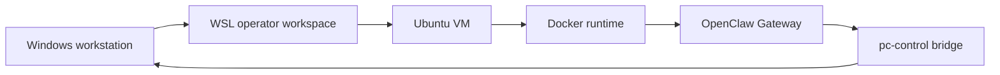

# Local Deployment Guide

## Purpose

This document is the authoritative deployment path for running OpenClaw in the isolated model used by this repository.

It is not a generic OpenClaw install guide. It describes the specific deployment pattern this workspace is built around:

- Windows workstation for the operator
- WSL for the operator shell and repo maintenance
- isolated Ubuntu VM for the OpenClaw runtime
- Docker-based runtime inside that VM
- optional narrow host-PC control through `pc-control`

## Deployment Model



## Why This Model Exists

This deployment model exists to avoid running the assistant runtime directly on the main workstation.

It gives clearer answers to:

- where the assistant runs
- where persistent state lives
- what can touch the Windows host directly
- where host-policy enforcement belongs

## Non-Goals

This guide does not attempt to define:

- highly available production architecture
- public internet exposure
- multi-tenant deployment
- every OpenClaw feature from day one

The goal is a clean isolated baseline.

## Prerequisites

### Operator side

- Windows workstation
- WSL workspace ready
- deployment repo checked out

Use:
- [wsl-codex-runbook.md](/home/mfshaf7/projects/openclaw-isolated-deployment/docs/wsl-codex-runbook.md)

### Runtime side

- dedicated Ubuntu VM
- Docker Engine installed
- enough CPU, RAM, and disk for your workload

Record actual choices in:
- [vm-baseline.md](/home/mfshaf7/projects/openclaw-isolated-deployment/deployment/vm-baseline.md)

## Baseline Runtime Build

### 1. Prepare the VM

- patch the OS
- create a non-root admin user
- keep unrelated workloads off the VM

### 2. Create the runtime workspace

```bash
mkdir -p ~/projects
cd ~/projects
git clone https://github.com/openclaw/openclaw.git upstream-openclaw
cd upstream-openclaw
```

### 3. Start from the upstream Docker path

Use the upstream OpenClaw Docker flow as the baseline runtime start.

Example baseline flow:

```bash
./docker-setup.sh
```

The exact upstream command may evolve. The important point is that this repository starts from the supported upstream Docker path, then layers isolated-deployment changes on top.

### 4. Record the first working state

Capture:

- upstream revision used
- commands run
- container status
- exposed ports
- first startup logs

## Repository-Specific Layers

After the upstream baseline is working, this repository adds the isolated-deployment layers.

### Layer A: bundled Telegram override

Use the local Telegram override as the bundled `telegram` plugin replacement instead of treating it as a second side-loaded `telegram` plugin.

Why:

- `telegram` is a built-in channel
- deterministic `pc-control` behavior belongs at the channel layer
- duplicate runtime plugin ids create ambiguity and loader noise

Relevant component:
- [openclaw-telegram-enhanced/README.md](/home/mfshaf7/projects/openclaw-isolated-deployment/openclaw-telegram-enhanced/README.md)

### Layer B: pc-control plugin

Install the `pc-control` plugin as a managed local plugin.

```bash
openclaw plugins install ./pc-control-openclaw-plugin
```

Relevant component:
- [pc-control-openclaw-plugin/README.md](/home/mfshaf7/projects/openclaw-isolated-deployment/pc-control-openclaw-plugin/README.md)

### Layer C: host bridge

Run the `pc-control-bridge` on the Windows/WSL side rather than trying to turn the isolated runtime into the host enforcement point.

Relevant component:
- [pc-control-bridge/README.md](/home/mfshaf7/projects/openclaw-isolated-deployment/pc-control-bridge/README.md)

## Network Boundary

The intended boundary is:

- OpenClaw runtime stays in the isolated VM/container
- host access is authenticated
- Windows firewall or equivalent host controls may still be the practical enforcement point for forwarded ports

Do not assume Docker-on-WSL localhost-only publishing is the only control you need or that it will always behave the same on every host.

## Secrets

- keep real secrets out of version control
- keep runtime secrets in the runtime environment or local secret files
- treat screenshots and logs as potentially sensitive

## Validation Checklist

Minimum validation for a usable isolated deployment:

1. gateway starts cleanly
2. UI or channel access works
3. persistent state location is known
4. Telegram or another chosen control surface works
5. bridge-backed host actions work only through the intended path

For bridge-backed features, the validation standard is stronger:

1. host bridge process exists
2. bridge local health works
3. bridge is reachable from the gateway
4. a real operation succeeds, not just `/healthz`

## Related Documents

- [architecture-overview.md](/home/mfshaf7/projects/openclaw-isolated-deployment/docs/architecture-overview.md)
- [security-architecture-review.md](/home/mfshaf7/projects/openclaw-isolated-deployment/docs/security-architecture-review.md)
- [pc-control-openclaw-model.md](/home/mfshaf7/projects/openclaw-isolated-deployment/docs/pc-control-openclaw-model.md)
