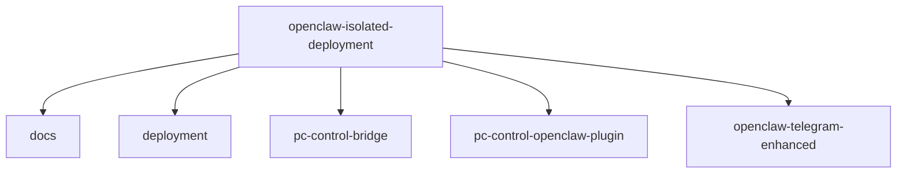

# Repository Map

## Purpose

This document explains why each repository or subproject exists in the `openclaw-isolated-deployment` workspace.

It is here because a new maintainer should not have to reverse-engineer the intent of every folder from commit history or filenames.

## Workspace Structure

## Documentation Placement Rule

Documentation in this workspace should follow one rule:

- put **system-wide** architecture, deployment, and trust-boundary documents in `docs/`
- put **component-specific** behavior, tool surface, and runtime notes in that component's own `README.md`

So:

- `docs/` explains how the whole isolated system works
- `pc-control-bridge/README.md` explains the bridge
- `pc-control-openclaw-plugin/README.md` explains the adapter plugin
- `openclaw-telegram-enhanced/README.md` explains the Telegram channel replacement

Canonical source ownership for this workspace model is:

- standalone repo: `pc-control-bridge`
- standalone repo: `openclaw-telegram-enhanced`
- workspace repo: `openclaw-isolated-deployment/pc-control-openclaw-plugin`

That keeps cross-cutting material centralized without hiding component contracts from the repos that implement them.

## Subproject Roles

### `pc-control-bridge/`

This is the host-control enforcement layer.

Why it exists:

- OpenClaw running in a VM should not directly own Windows host policy
- host access needs explicit allowed roots, operation classes, and audit logging
- deterministic Telegram behavior is only credible if the host side is also typed and constrained

It is the place where host-specific implementation details belong.

The runnable bridge code lives in the standalone `pc-control-bridge` repository. The bridge folder in this workspace is documentation-oriented.

### `pc-control-openclaw-plugin/`

This is the typed adapter between OpenClaw and the bridge.

Why it exists:

- the model should call explicit tools, not improvise shell operations
- OpenClaw needs a clean way to expose bridge operations as tools with confirmation and policy semantics
- the bridge protocol should not leak directly into user-facing prompts

This repository turns bridge operations into OpenClaw-native tools.

### `openclaw-telegram-enhanced/`

This is a bundled replacement for the built-in Telegram channel.

Why it exists:

- stock Telegram behavior was not strict enough for deterministic host-control flows
- screenshot delivery, button-confirmed proposals, and `pc-control` routing needed channel-level changes
- built-in channel replacement is cleaner than carrying a broad core fork for Telegram-specific behavior

This repository exists because the channel itself needed opinionated behavior, not just extra tools.

The Telegram source of truth is the standalone `openclaw-telegram-enhanced` repository. This workspace also carries a deployment copy used by the bundled-image path.

### `docs/`

This is the documentation source of truth for the isolated deployment model.

Why it exists:

- upstream docs do not explain this repository’s isolation choices
- local deployment history is not enough; operators need durable architecture and runbook docs
- durable maintenance requires explanation, diagrams, and trust-boundary language

### `deployment/`

This holds deployment-specific guidance and operator-facing configuration notes.

Why it exists:

- some deployment concerns are narrower than the main architecture docs
- checklist and baseline docs should not pollute component READMEs
- this is where environment-specific deployment procedure lives

## Why Not Collapse Everything Into One Repo Layer

Because the layers represent different responsibilities:

- **upstream runtime**
- **host enforcement**
- **tool adapter**
- **channel behavior**
- **operator documentation**

If these are mixed together without explanation, the repository becomes difficult to maintain and reason about.

## How To Read The Workspace

If you want to understand:

- the system model: start with [architecture-overview.md](architecture-overview.md)
- the deployment baseline: read [local-deployment-guide.md](local-deployment-guide.md)
- the multi-repo sync rules: read [workspace-sync-policy.md](workspace-sync-policy.md)
- the host-control security model: read [pc-control-openclaw-model.md](pc-control-openclaw-model.md)
- the actual bridge contract: read [README.md](../pc-control-bridge/README.md)
- the OpenClaw adapter contract: read [README.md](../pc-control-openclaw-plugin/README.md)
- the Telegram channel contract: read [README.md](../openclaw-telegram-enhanced/README.md)
