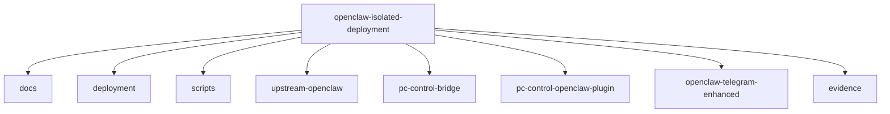

# Repository Map

## Purpose

This document explains why each repository or subproject exists in the `openclaw-isolated-deployment` workspace.

It is here because a new maintainer should not have to reverse-engineer the intent of every folder from commit history or filenames.

## Workspace Structure

## Documentation Placement Rule

Documentation in this workspace should follow one rule:

- put **system-wide** architecture, deployment, and trust-boundary documents in `docs/`
- put **component-specific** behavior, tool surface, and runtime notes in that component's own `README.md`

So:

- `docs/` explains how the whole isolated system works
- `pc-control-bridge/README.md` explains the bridge
- `pc-control-openclaw-plugin/README.md` explains the adapter plugin
- `openclaw-telegram-enhanced/README.md` explains the Telegram channel replacement

That keeps cross-cutting material centralized without hiding component contracts from the repos that implement them.

## Subproject Roles

### `upstream-openclaw/`

This is the upstream OpenClaw codebase used as the baseline runtime.

Why it exists here:

- to make the isolated deployment reproducible from a known upstream baseline
- to keep local overrides and deployment changes close to the runtime they affect
- to make it clear what is upstream behavior vs what is local adaptation

What it is **not**:

- the place to document the isolated deployment model
- the place to explain Windows host-control policy
- the place to document local operational quirks of this deployment

Those explanations belong in the outer repository docs.

### `pc-control-bridge/`

This is the host-control enforcement layer.

Why it exists:

- OpenClaw running in a VM should not directly own Windows host policy
- host access needs explicit allowed roots, operation classes, and audit logging
- deterministic Telegram behavior is only credible if the host side is also typed and constrained

It is the place where host-specific implementation details belong.

### `pc-control-openclaw-plugin/`

This is the typed adapter between OpenClaw and the bridge.

Why it exists:

- the model should call explicit tools, not improvise shell operations
- OpenClaw needs a clean way to expose bridge operations as tools with confirmation and policy semantics
- the bridge protocol should not leak directly into user-facing prompts

This repository turns bridge operations into OpenClaw-native tools.

### `openclaw-telegram-enhanced/`

This is a bundled replacement for the built-in Telegram channel.

Why it exists:

- stock Telegram behavior was not strict enough for deterministic host-control flows
- screenshot delivery, button-confirmed proposals, and `pc-control` routing needed channel-level changes
- built-in channel replacement is cleaner than carrying a broad core fork for Telegram-specific behavior

This repository exists because the channel itself needed opinionated behavior, not just extra tools.

### `docs/`

This is the documentation source of truth for the isolated deployment model.

Why it exists:

- upstream docs do not explain this repository’s isolation choices
- local deployment history is not enough; operators need durable architecture and runbook docs
- durable maintenance requires explanation, diagrams, and trust-boundary language

### `deployment/`

This holds deployment-specific guidance and operator-facing configuration notes.

Why it exists:

- some deployment concerns are narrower than the main architecture docs
- checklist and baseline docs should not pollute component READMEs
- this is where environment-specific deployment procedure lives

### `scripts/`

This holds the executable operator glue.

Why it exists:

- the runtime needs repeatable start, repair, and verification procedures
- self-heal should reflect the real known-good procedure, not folklore
- scripts are part of the deployment contract, not just convenience snippets

### `evidence/`

This stores sanitized proof of failures, validations, and screenshots.

Why it exists:

- an isolated deployment repo should preserve operational truth
- evidence helps explain why docs and procedures changed
- this is useful during publication review and postmortems

## Why Not Collapse Everything Into One Repo Layer

Because the layers represent different responsibilities:

- **upstream runtime**
- **host enforcement**
- **tool adapter**
- **channel behavior**
- **operator documentation**

If these are mixed together without explanation, the repository becomes difficult to maintain and reason about.

## How To Read The Workspace

If you want to understand:

- the system model: start with [architecture-overview.md](/home/mfshaf7/projects/openclaw-isolated-deployment/docs/architecture-overview.md)
- the deployment baseline: read [local-deployment-guide.md](/home/mfshaf7/projects/openclaw-isolated-deployment/docs/local-deployment-guide.md)
- the host-control security model: read [pc-control-openclaw-model.md](/home/mfshaf7/projects/openclaw-isolated-deployment/docs/pc-control-openclaw-model.md)
- the actual bridge contract: read [README.md](/home/mfshaf7/projects/openclaw-isolated-deployment/pc-control-bridge/README.md)
- the OpenClaw adapter contract: read [README.md](/home/mfshaf7/projects/openclaw-isolated-deployment/pc-control-openclaw-plugin/README.md)
- the Telegram channel contract: read [README.md](/home/mfshaf7/projects/openclaw-isolated-deployment/openclaw-telegram-enhanced/README.md)
