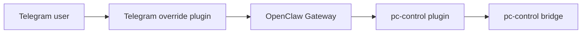

# Telegram Override Plugin

This package replaces the bundled OpenClaw `telegram` channel in deployments that need stricter, more deterministic Telegram behavior for host-control workflows.

It exists because Telegram was not just another channel in this system. It became a primary control surface for sensitive `pc-control` actions.

## Why This Exists

The default channel behavior was not enough for this deployment because Telegram needed to support:

- deterministic `pc-control` routing
- button-based confirmations
- desktop screenshot capture and delivery
- media delivery for staged host files
- rejection of fake “I will use the tool” responses on host-control paths

Those are channel-behavior concerns, not bridge concerns and not generic OpenClaw core concerns.

## Architecture Role

## What This Plugin Adds

This override currently carries the Telegram-side logic for:

- forced host desktop screenshot handling
- Telegram document delivery for bridge-staged files and screenshots
- deterministic `pc-control` proposal and confirmation flows
- inline `Proceed` / `Cancel` button handling
- direct Telegram routing for selected `pc-control` operations
- suppression of misleading freeform replies on tool-required host actions

## Deployment Model

This is a **bundled channel replacement**, not a normal side-loaded plugin.

The runtime plugin id remains `telegram`.

The supported deployment approach is:

- replace the bundled Telegram plugin in the deployment image or bundled plugin tree

The unsupported long-lived approach is:

- loading a second plugin with the same `telegram` id through generic plugin path overrides

This distinction matters because `telegram` is a built-in channel, not a normal optional extension.

## Why This Is Separate From `pc-control`

The `pc-control` plugin knows how to expose bridge operations as tools.

This Telegram override knows how to make those tool-backed flows behave well in Telegram:

- how confirmation buttons work
- how file delivery maps to Telegram media behavior
- how screenshot requests should bypass generic model chatter
- how deterministic read flows should bypass hallucinating text replies

Keeping those responsibilities separate avoids mixing channel UX with host policy enforcement.

## Current Focus Areas

The most important code paths in this repository for the isolated deployment are:

- [bot-message-dispatch.ts](/home/mfshaf7/projects/openclaw-isolated-deployment/openclaw-telegram-enhanced/src/bot-message-dispatch.ts)
- [bot-message-dispatch.pc-control.ts](/home/mfshaf7/projects/openclaw-isolated-deployment/openclaw-telegram-enhanced/src/bot-message-dispatch.pc-control.ts)
- [bot-handlers.runtime.ts](/home/mfshaf7/projects/openclaw-isolated-deployment/openclaw-telegram-enhanced/src/bot-handlers.runtime.ts)
- [bot/delivery.ts](/home/mfshaf7/projects/openclaw-isolated-deployment/openclaw-telegram-enhanced/src/bot/delivery.ts)

## Tests

This package already contains a large Telegram-specific test surface.

For the isolated deployment work, the most relevant tests are under:

- [bot-message-dispatch.test.ts](/home/mfshaf7/projects/openclaw-isolated-deployment/openclaw-telegram-enhanced/src/bot-message-dispatch.test.ts)
- [inline-buttons.test.ts](/home/mfshaf7/projects/openclaw-isolated-deployment/openclaw-telegram-enhanced/src/inline-buttons.test.ts)
- [lane-delivery.test.ts](/home/mfshaf7/projects/openclaw-isolated-deployment/openclaw-telegram-enhanced/src/lane-delivery.test.ts)
- [monitor.test.ts](/home/mfshaf7/projects/openclaw-isolated-deployment/openclaw-telegram-enhanced/src/monitor.test.ts)

## Related Documents

- [README.md](/home/mfshaf7/projects/openclaw-isolated-deployment/README.md)
- [architecture-overview.md](/home/mfshaf7/projects/openclaw-isolated-deployment/docs/architecture-overview.md)
- [README.md](/home/mfshaf7/projects/openclaw-isolated-deployment/pc-control-openclaw-plugin/README.md)
- [README.md](/home/mfshaf7/projects/openclaw-isolated-deployment/pc-control-bridge/README.md)
