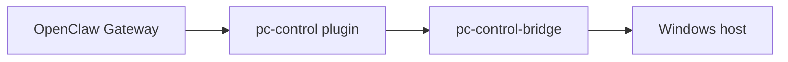

# pc-control-bridge

`pc-control-bridge` is the host-side enforcement layer for the isolated OpenClaw deployment.

It exists because the OpenClaw runtime is intentionally isolated in a VM/container and should not directly own the Windows host trust boundary.

## Why This Exists

Without a separate bridge, host-PC control usually degenerates into one of these:

- broad shell execution from the assistant runtime
- ad hoc scripts with no clear policy boundary
- channel-specific hacks that reach directly into the host

This bridge exists to avoid that.

Its role is to provide:

- typed host operations
- allowed-root enforcement
- explicit permission classes
- audit logging
- export staging
- host-specific implementations for Windows and WSL environments

## What The Bridge Owns

The bridge is responsible for:

- path policy
- operation dispatch
- authentication
- audit records
- host-specific file and display operations
- self-heal verification inputs

The bridge is **not** responsible for:

- channel UX
- assistant prompting
- general OpenClaw orchestration
- model behavior

Those belong to OpenClaw and the Telegram override layer.

## Architecture Role



The bridge is the host trust anchor in that chain.

## Current Operation Classes

The bridge groups operations into policy classes.

- `read`
  - health
  - file list/search/read metadata
  - browser tab listing
- `organize`
  - create folder
  - move or rename files/folders
- `export`
  - stage files for Telegram
  - zip for export
  - screenshots
- `admin_high_risk`
  - allowed-root changes
  - host discovery outside allowed roots
  - monitor power

See the operation registry in:
- [types.mjs](/home/mfshaf7/projects/openclaw-isolated-deployment/pc-control-bridge/src/types.mjs)
- [dispatcher.mjs](/home/mfshaf7/projects/openclaw-isolated-deployment/pc-control-bridge/src/dispatcher.mjs)

## Notable Operations

- `health.check`
- `config.allowed_roots.list`
- `config.allowed_roots.add`
- `config.allowed_roots.remove`
- `config.host_discovery.overview`
- `config.host_discovery.browse`
- `fs.list`
- `fs.search`
- `fs.read_meta`
- `fs.mkdir`
- `fs.move`
- `fs.stage_for_telegram`
- `fs.zip_for_export`
- `display.screenshot`
- `display.monitor_power`

## Configuration

Policy and runtime config live under:

- [policy.example.json](/home/mfshaf7/projects/openclaw-isolated-deployment/pc-control-bridge/config/policy.example.json)
- [policy.wsl.example.json](/home/mfshaf7/projects/openclaw-isolated-deployment/pc-control-bridge/config/policy.wsl.example.json)

Local active variants in this workspace include:

- [policy.json](/home/mfshaf7/projects/openclaw-isolated-deployment/pc-control-bridge/config/policy.json)
- [policy.local.json](/home/mfshaf7/projects/openclaw-isolated-deployment/pc-control-bridge/config/policy.local.json)

## Deployment Notes

In this isolated deployment model, the bridge normally runs on the Windows/WSL side while the OpenClaw gateway runs in Docker inside the isolated VM/runtime path.

The practical network pattern in this repository is:

- bridge internal listener inside WSL
- Windows proxy entrypoint for Docker/container reachability
- token-authenticated bridge calls from the gateway

The bridge is also part of the self-heal chain, but self-heal should only be considered correct if it verifies real end-to-end behavior, not just proxy liveness.

## Tests

Current local bridge tests include:

- [display.test.mjs](/home/mfshaf7/projects/openclaw-isolated-deployment/pc-control-bridge/test/display.test.mjs)
- [fs.test.mjs](/home/mfshaf7/projects/openclaw-isolated-deployment/pc-control-bridge/test/fs.test.mjs)
- [policy.test.mjs](/home/mfshaf7/projects/openclaw-isolated-deployment/pc-control-bridge/test/policy.test.mjs)

Run:

```bash
node --test test/*.test.mjs
```

## Relationship To The Rest Of The Workspace

- Architecture and rationale: [architecture-overview.md](/home/mfshaf7/projects/openclaw-isolated-deployment/docs/architecture-overview.md)
- Host-control model: [pc-control-openclaw-model.md](/home/mfshaf7/projects/openclaw-isolated-deployment/docs/pc-control-openclaw-model.md)
- OpenClaw adapter: [README.md](/home/mfshaf7/projects/openclaw-isolated-deployment/pc-control-openclaw-plugin/README.md)
- Telegram override: [README.md](/home/mfshaf7/projects/openclaw-isolated-deployment/openclaw-telegram-enhanced/README.md)
